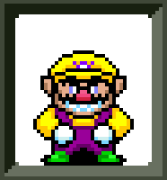

# CI Übung - Team Wario

Let's do this!!!!11

## Fragen

1) Wie viel Code Coverage wird durch die Tests erzielt?

2) Was ist der Unterschied zwischen Branch- und Line
Coverage?

3) Welche Art von Problemen zeigt Checkstyle auf?

4) Sollte man davon alle beheben?
Was macht Sinn?

5) Betrachten Sie die Meldungen von PMD.
Wie unterscheiden sich diese von Checkstyle?
